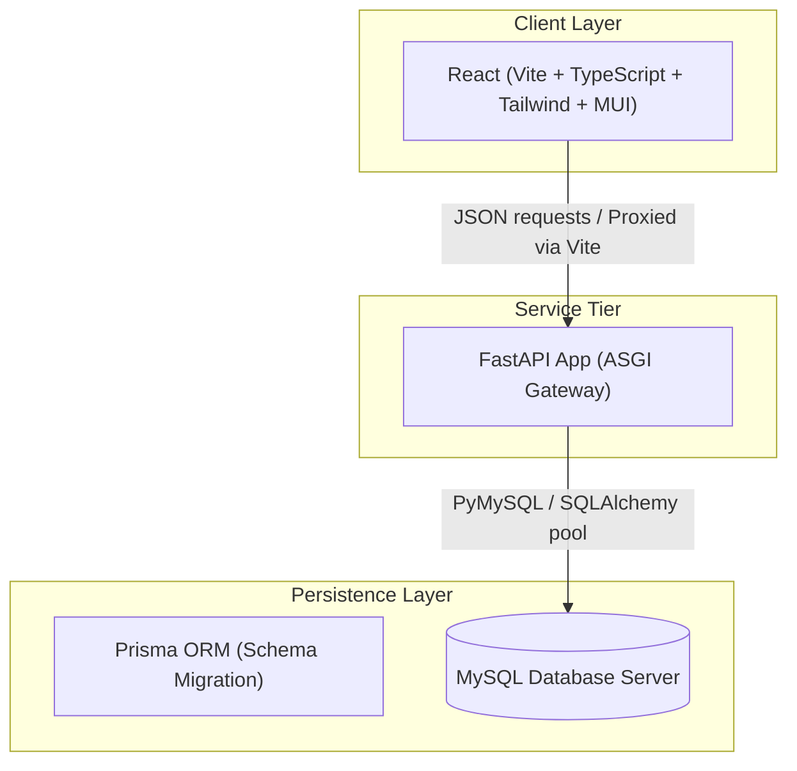

# CampusGPT X

## AI-Powered Smart Campus Operating System (Day 1 Foundation)

CampusGPT X is a modular, scalable smart campus management platform built with high performance, resilience, and type safety as core design tenets. Today, we establish the core workspace architecture, setting up decoupled API servers and frontend applications.

---

## 1. High-Level Architecture

CampusGPT X adopts a clean, modular structure split into three main tiers:



### Request Flow
1.  **Client Dispatch**: The React SPA dispatches an API request. In local dev, Vite proxies `/api` to `http://localhost:8000`. In production, Nginx proxies `/api` requests to the backend service.
2.  **FastAPI Middleware**: The app logs details, handles CORS validation, and initiates error boundaries.
3.  **Dependency Injection**: The router passes the database connection pool using FastAPI `Depends(get_db)`.
4.  **SQLAlchemy Database Access**: SQLAlchemy executes operations against the MySQL database.
5.  **Standardized Response**: The client receives a uniform envelope containing either `data` or `error` objects.

---

## 2. Workspace Directories

```text
CampusGPT/
├── .github/workflows/         # Automated GitHub pipelines (CI testing/checking)
├── apps/                      # Build applications
│   ├── backend/               # FastAPI backend engine code
│   └── frontend/              # Vite React TypeScript client code
├── packages/                  # Workspace shared utilities/configurations
│   └── README.md
├── docker/                    # Isolated docker assets and Dockerfiles
│   ├── Dockerfile.backend
│   ├── Dockerfile.frontend
│   └── nginx.frontend.conf    # SPA proxy server rules
├── prisma/                    # Relational schema migrations and Prisma files
│   └── schema.prisma          # Database mapping source of truth
├── docs/                      # Global architecture logs & ADR files
├── tests/                     # Integration tests checking API states
├── uploads/                   # Upload files target (gitignored)
├── logs/                      # Backend text log files (gitignored)
├── scripts/                   # Workspace shell automations
├── .gitignore                 # Exclusion configuration rules
├── docker-compose.yml         # Compose configuration orchestrating containers
└── package.json               # Root workspace configuration
```

---

## 3. Environment Installations

### Prerequisites Setup (Windows)

1.  **Node.js**: Download and run the installer (v20+) from [nodejs.org](https://nodejs.org/). Add node binaries to your User Path variables during setup.
2.  **Python**: Install Python 3.11+ from [python.org](https://python.org/). Mark the **"Add Python to PATH"** checkbox before initiating installation.
3.  **MySQL**: Download and configure MySQL Community Server from [mysql.com](https://dev.mysql.com/downloads/installer/). Add the bin directory path (e.g., `C:\Program Files\MySQL\MySQL Server 8.0\bin`) to your System Path variables.
4.  **Docker Desktop**: Install Docker Desktop from [docker.com](https://www.docker.com/). Ensure the WSL 2 integration checkbox is ticked.
5.  **Git**: Install Git from [git-scm.com](https://git-scm.com/) using standard recommended wizard properties.

### Recommended VS Code Extensions
Click the Extensions button on the left sidebar (Ctrl+Shift+X) and install:
*   **Python** (`ms-python.python`)
*   **Pylance** (`ms-python.vscode-pylance`)
*   **Prisma** (`prisma.prisma`)
*   **Tailwind CSS IntelliSense** (`bradlc.vscode-tailwindcss`)
*   **ESLint** (`dbaeumer.vscode-eslint`)
*   **Prettier - Code Formatter** (`esbenp.prettier-vscode`)

---

## 4. Run & Development Commands

Open your terminal in the workspace root:

### Step A: Monorepo Node Dependencies
Install all package workspaces defined:
```bash
npm install
```

### Step B: Run Database Container
Use Docker Compose to spin up your local MySQL service:
```bash
docker compose up -d db
```

### Step C: Apply Database Schema & Migrations
Synchronize your database using Prisma ORM. Copy root `.env` config:
```bash
npx prisma db push
```

### Step D: Backend Local Run
1. Navigate to backend:
   ```bash
   cd apps/backend
   ```
2. Create and activate a virtual environment:
   ```bash
   python -m venv venv
   .\venv\Scripts\activate
   ```
3. Install dependencies:
   ```bash
   pip install -r requirements.txt
   ```
4. Run FastAPI:
   ```bash
   uvicorn app.main:app --reload --port 8000
   ```
   *Your API docs will be available at `http://127.0.0.1:8000/docs`.*

### Step E: Frontend Local Run
1. Open another terminal in the project root.
2. Launch Vite dev server:
   ```bash
   npm run dev:frontend
   ```
   *Your UI dashboard will be running at `http://localhost:5173/`.*

---

## 5. Branching & Commit Guidelines

### Git Branching Model
*   **`main`**: Represents production-ready code. Directly pushing to this branch is disabled.
*   **`feature/day-X-topic`**: Standard feature tracking branch. Create PRs pointing towards `main`.
*   **`bugfix/issue-topic`**: Used for quick hotfixes and patches.

### Conventional Commits
Format your logs as: `<type>(<scope>): <short description>`
*   `feat`: Adding a new feature (e.g. `feat(api): add auth endpoint`).
*   `fix`: Standard code correction (e.g. `fix(db): correct user schema relationships`).
*   `chore`: Tooling/dependency changes (e.g. `chore(deps): update prisma versions`).
*   `docs`: Documentation improvements (e.g. `docs: update setup commands`).

---

## 6. Testing Guide

Run Python integration and health tests locally:
```bash
python -m pytest tests/
```
These tests utilize mock database session connection overrides, meaning you do not need to run MySQL to validate API endpoint routers!

---

## 📖 System Documentation

For detailed guides and deep dives:
* [API.md](file:///c:/Users/DELL/OneDrive/Desktop/CampusGPT/API.md) — Endpoint structures, headers, payloads, and examples.
* [DATABASE.md](file:///c:/Users/DELL/OneDrive/Desktop/CampusGPT/DATABASE.md) — Schema definitions, keys, and cascades.
* [ARCHITECTURE.md](file:///c:/Users/DELL/OneDrive/Desktop/CampusGPT/ARCHITECTURE.md) — Multi-tier micro-services diagrams and design choices.
* [CHANGELOG.md](file:///c:/Users/DELL/OneDrive/Desktop/CampusGPT/CHANGELOG.md) — Complete release milestones tracking.
* [academic_structure.md](file:///C:/Users/DELL/.gemini/antigravity-ide/brain/6814b530-b666-4f74-bfb2-40f328843fb5/academic_structure.md) — Academic structure domain workflows.
* [student_portal.md](file:///C:/Users/DELL/.gemini/antigravity-ide/brain/6814b530-b666-4f74-bfb2-40f328843fb5/student_portal.md) — Student portal workflows and security schemas.
* [faculty_portal.md](file:///C:/Users/DELL/.gemini/antigravity-ide/brain/6814b530-b666-4f74-bfb2-40f328843fb5/faculty_portal.md) — Faculty portal workflows and security schemas.
* [timetable_management.md](file:///C:/Users/DELL/.gemini/antigravity-ide/brain/6814b530-b666-4f74-bfb2-40f328843fb5/timetable_management.md) — Smart timetable workflows and AI constraint schemas.
* [attendance_management.md](file:///C:/Users/DELL/.gemini/antigravity-ide/brain/6814b530-b666-4f74-bfb2-40f328843fb5/attendance_management.md) — Attendance management design and auto-recalculation algorithms.
* [qr_attendance.md](file:///C:/Users/DELL/.gemini/antigravity-ide/brain/6814b530-b666-4f74-bfb2-40f328843fb5/qr_attendance.md) — Secure Dynamic QR check-in geofence algorithms.
* [face_recognition.md](file:///C:/Users/DELL/.gemini/antigravity-ide/brain/6814b530-b666-4f74-bfb2-40f328843fb5/face_recognition.md) — Biometric facial recognition and spoof-protection logic models.
* [assignment_management.md](file:///C:/Users/DELL/.gemini/antigravity-ide/brain/6814b530-b666-4f74-bfb2-40f328843fb5/assignment_management.md) — Assignment publishing, uploads, evaluations, and grading workflows.
* [examination_management.md](file:///C:/Users/DELL/.gemini/antigravity-ide/brain/6814b530-b666-4f74-bfb2-40f328843fb5/examination_management.md) — Exam schema constraints, seat allocations, admit cards, and approvals.
* [result_management.md](file:///C:/Users/DELL/.gemini/antigravity-ide/brain/6814b530-b666-4f74-bfb2-40f328843fb5/result_management.md) — Result schemes, GPAs, transcripts, and revaluations.

